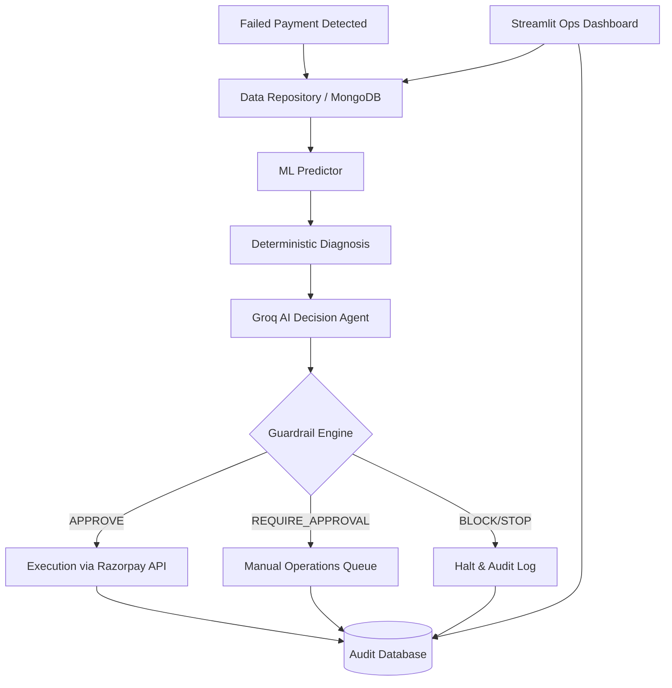

# RecoverAI 🚀

> **An AI-powered, guardrailed revenue recovery system.**
> *Built for the Razorpay Buildathon | Track 03: AI Revenue Recovery*

RecoverAI is an intelligent, scalable fintech operations platform designed to safely maximize revenue recovery from failed customer payments. It utilizes predictive machine learning to evaluate recovery probability and employs a bounded Generative AI decision agent to recommend the best recovery strategy. Crucially, every AI action is strictly vetted by a deterministic Guardrail Engine before any financial or communication actions are executed.

---

## 🎯 The Core Problem & Our Solution

Merchants lose significant revenue when customer payments fail, but sending blanket reminders to everyone is inefficient and often harmful to the customer experience. 

**RecoverAI solves this by providing:**
1. **Predictive Scoring**: A Logistic Regression model predicts the exact probability of successful recovery based on customer history and failure reasons.
2. **Intelligent Decisioning**: An AI Agent (`openai/gpt-oss-20b` via Groq) prescribes optimal recovery channels (e.g., immediate retry, SMS reminder, discount offer, manual review).
3. **Strict Guardrails**: Deterministic rules block the AI from taking risky actions (e.g., attempting recovery on suspected fraud, or spamming a customer who has already paid).
4. **Operations Dashboard**: A premium, Linear-inspired Streamlit interface for operations teams to monitor the queue, run simulations, and review granular audit trails.

---

## 🏗️ Architecture & Workflow



### The Recovery Pipeline

1. **Diagnosis**: Analyzes customer tenure, payment history, and failure reasons.
2. **Prediction**: Predicts probability of recovery.
3. **AI Recommendation**: The LLM consumes the diagnosis and prediction to formulate a recovery strategy and confidence score.
4. **Guardrail Validation**: The system strictly checks the AI's recommendation against business rules (e.g., maximum contact attempts, fraud flags).
5. **Execution**: If allowed, the system generates a Razorpay Payment Link (currently in Demo Mode) and updates the audit log.

---

## 🧠 Machine Learning Metrics

The system dynamically evaluates both Logistic Regression and Random Forest models during training on a synthetic dataset of realistic payment failures. The final model is selected based on the F1-score.

**Held-Out Test Set Results (Currently Selected: Logistic Regression):**
- **Accuracy**: `0.7400`
- **Precision (Recoverable Class)**: `0.7625`
- **Recall (Recoverable Class)**: `0.8971`
- **F1-Score (Recoverable Class)**: `0.8243`
- **ROC-AUC**: `0.7493`

*Top Features Influencing Prediction:*
- 🟢 `previous_recovery_success` (+0.40)
- 🟢 `successful_payments` (+0.32)
- 🔴 `failure_reason_suspected_fraud` (-2.28)

---

## 🛠️ Tech Stack & Integrations

- **Backend Logic**: Python 3.11
- **Machine Learning**: `scikit-learn`, `pandas`
- **AI Agent**: Groq API (`openai/gpt-oss-20b`), Structured JSON outputs via Pydantic
- **Database**: MongoDB (Atlas) for Case Management and Audit Trails
- **Payment Gateway**: Razorpay API (Payment Links)
- **Frontend**: Streamlit with custom CSS (Stripe/Linear aesthetics)

---

## 🚀 Setup Instructions

### 1. Prerequisites
- Python 3.10+
- MongoDB Atlas cluster (or local instance)
- Groq API Key
- Razorpay API Keys

### 2. Installation
```bash
# Clone the repository
git clone https://github.com/your-username/recoverai.git
cd recoverai

# Create and activate virtual environment
python -m venv venv
.\venv\Scripts\activate  # Windows
# source venv/bin/activate # Mac/Linux

# Install dependencies
pip install -r requirements.txt
```

### 3. Environment Variables
Create a `.env` file in the root directory based on `.env.example`:

```env
MONGODB_URI=mongodb+srv://<user>:<password>@cluster.mongodb.net/
GROQ_API_KEY=gsk_your_api_key_here
RAZORPAY_KEY_ID=rzp_test_your_key_id
RAZORPAY_KEY_SECRET=your_key_secret
DEMO_MODE=True
```

> [!WARNING]
> **Razorpay Integration Note**: The application defaults to `DEMO_MODE=True`. In this mode, no real network calls are made to Razorpay; the system simulates successful link generation for demo purposes. To generate real test payment links, set `DEMO_MODE=False` and provide valid Test credentials.

### 4. Running the Application
```bash
# Start the Streamlit Dashboard
streamlit run app.py
```
Navigate to `http://localhost:8501` to access the operations dashboard.

---

## 🎮 Demo Scenarios

The sidebar in the application provides 3 one-click scenarios to demonstrate the orchestrator's capability to judges:

1. **Successful Recovery**: Demonstrates the happy path where a network error on a high-value customer results in a `retry_immediate` AI action, which safely passes guardrails and generates a Razorpay link.
2. **Guardrail Block**: Simulates a case with repeated `insufficient_funds` failures where maximum contact attempts have been exceeded. The guardrail engine intercepts and **BLOCKS** the AI's attempt to retry.
3. **Graceful Cancellation**: Simulates a race condition where the customer has `already_paid` through another channel. The guardrail engine halts the workflow immediately.

---

## 🔮 Limitations & Future Improvements

- **Demo Constraints**: The current synthetic data generation is simplistic. A production deployment would train on historical merchant telemetry data.
- **Agent Capabilities**: Currently, the AI is a single-shot decision agent. In the future, this could be expanded into a multi-agent system where one agent negotiates with the customer via SMS/Email while another assesses risk.
- **Webhooks**: True async recovery requires setting up Razorpay Webhooks (`payment.link.paid`) to automatically mark cases as closed, which is out of scope for this hackathon MVP.
- **Frontend State**: Streamlit is excellent for operations dashboards, but a consumer-facing payment portal would require a React/Next.js stack.
